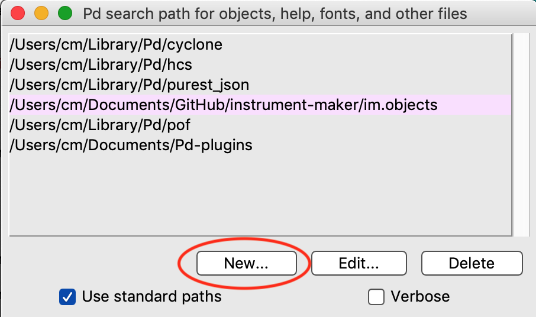

**Instrument Maker** is an open source framework for digital instrument building with sensors, for [Pure Data](http://puredata.info/) running on embedded computers such as [Bela](http://bela.io) / [Raspberry Pi](https://www.raspberrypi.org/) + [Arduino](https://www.arduino.cc/).  

<!--Some rough documentation is being generated here: <https://instrumentmaker.org/im-reference/>.-->
Key pages:
- [**Learning Pd through Instrument Maker**](documentation/manual/learning-pd-through-im.md) (work in progress)
- [**GitHub repo**](https://github.com/matthewscharles/instrument-maker/)
- [**Instrument Maker Communication Symbols**](https://instrumentmaker.org/instrument-maker-symbols/)
- [**Wiki: further information and development notes.**](https://github.com/matthewscharles/instrument-maker/wiki)  
<!-- - **[Education Makers version](https://github.com/educationmakers/instrument-maker)** (development in an education technology context with Milieux Institute). -->

Distributed under the terms of the **GNU Public license version 3**.

The code is developed by [Charles Matthews](http://ardisson.net/), initially through workshops in collaboration with [Gift Tshuma](http://www.utchoir.com/), and with more in the pipeline through our project [Blurring the Boundaries](http://www.blurringtheboundaries.org/).  

Thanks to [Roybn Steward](https://www.robynsteward.com/music), [Education Makers](http://www.educationmakers.ca/), and [Dave Darch](http://alittlelearning.org/) (+ many more) for testing the code and helping generate documentation.

---

Read about the philosophy behind this framework at the [Bela.io blog](https://blog.bela.io/2019/08/20/towards-disabled-artist-led-music-technology-charles-matthews/).

---

---

## Disclaimer

Instrument Maker is one of my first public repos, and will definitely be messy for a while.

Please feel free to explore, and download and try out the abstractions if you are already familiar with Pure Data..but I recommend waiting a little while until everything's more coherent.

---

## How does it work?

The main Instrument Maker resource is a library of objects for [Pure Data](http://puredata.info/).

Having downloaded the library, create and connect building blocks in the form of obects with the `im.` prefix: e.g. inputs, outputs, tuning systems, processors, and synthesisers. Upload this code to Bela, or use a Raspberry Pi with an Arduino-type device connected.  

Using Bela, choosing a setup should be a case of dragging and dropping into a browser. The Pure Data files can exist as templates or presets; no need to edit or look at the code, unless desired.

----

# Current demo setup

*Deken release coming soon.*

We are currently focusing on Raspberry Pi/desktop setups, but will be updating with instructions for Bela again soon (including the new IDE).  

**Recommended: clone this repo**

- Clone the repo to a local folder by opening a terminal:
  - `git clone https://github.com/matthewscharles/instrument-maker`
  - *On a Mac, you might be required to download developer tools. There is no need to install Xcode if prompted.*
  - Keep up to date by periodically typing `git pull` within the folder in terminal.

**Direct download**
Click the green Clone or Download icon at the top of the [GitHub repo](https://github.com/matthewscharles/instrument-maker) to download a zip file.  If doing so, you will need to download updates manually in the future.

**Installation**

- Install [Pure Data](http://puredata.info/downloads)

  - *On a Mac, you may need to right-click on the downloaded application to open it.*

- Add the instrument-maker folder to the search path in Pure Data: click new, and browse to the folder you cloned to.

  

  

- Look for \_im-current-objects.pd in the main folder

- Right-click on the objects found here to open help files.  Make sure you press `ctrl-E` to enter edit mode before clicking on any boxes!

