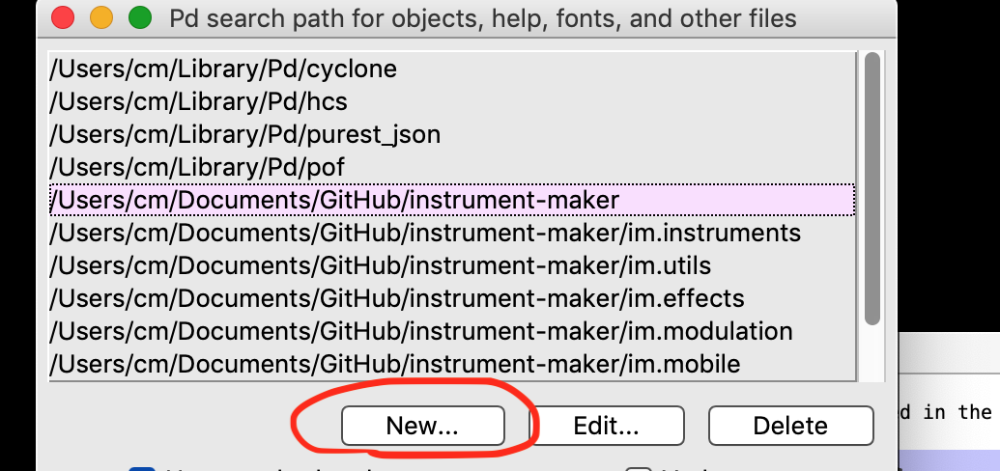

# Instrument Maker

Instrument Maker is an open source framework for digital instrument building with sensors. For [Pure Data](http://puredata.info/) running on [Bela](http://bela.io) / [Raspberry Pi](https://www.raspberrypi.org/) + [Arduino](https://www.arduino.cc/).  An accompanying set of communication symbols can be found [here](https://instrumentmaker.org/instrument-maker-symbols).

The code is developed by [Charles Matthews](http://ardisson.net/), with workshops currently in development in collaboration with [Gift Tshuma](http://www.utchoir.com/), and more in the pipeline through our project [Blurring the Boundaries](http://www.blurringtheboundaries.org/).  Many thanks to [Roybn Steward](https://www.robynsteward.com/music) and [Dave Darch](http://alittlelearning.org/) for testing the code in workshops and helping generate documentation.

<!--Some rough documentation is being generated here: <https://instrumentmaker.org/im-reference/>.-->

[**Introductory document**](documentation/manual/learning-pd-through-im.md) (work in progress)

[**GitHub repo**](https://github.com/matthewscharles/instrument-maker/documentation/manual/learning-pd-through-im.md) 

**[Education Makers version](https://github.com/educationmakers/instrument-maker)** (developing materials in an education technology context)

Distributed under the terms of the **GNU Public license version 3** (for now).

---

Read about the philosophy behind this framework at the [Bela.io blog](https://blog.bela.io/2019/08/20/towards-disabled-artist-led-music-technology-charles-matthews/).

[**Please access the wiki for more information and development notes.**](https://github.com/matthewscharles/instrument-maker/wiki)  

## Disclaimer

Instrument Maker is one of my first public repos, and will definitely be messy for a while.

The current code is not ready for public consumption (see the technical notes below); please feel free to explore, and download and try out the abstractions if you are already familiar with Pure Data..but I recommend waiting a little while until everything's more coherent.

## How does it work?

The main resource is an library of objects for [Pure Data](http://puredata.info/). 

Having downloaded the library, create and connect building blocks in the form of obects with the `im.` prefix: e.g. inputs, outputs, tuning systems, processors, and synthesisers. Upload this code to Bela, or use a Raspberry Pi with an Arduino-type device connected.  

Using Bela, choosing a setup should be a case of dragging and dropping into a browser; the Pure Data files can exist as templates or presets, no need to edit or look at the code unless desired.

<!--An accompanying hardware component is currently under development, which adds crocodile clip access to the Bela platform.-->

<!---->

----

# Current demo setup

We are currently focusing on Raspberry Pi/desktop setups, but will be updating with instructions for Bela again soon (including the new IDE).  *Deken release coming soon.*

For anyone interested in trying the current demo:

**Recommended: clone this repo**

- Clone the repo to a local folder by opening a terminal: 
  - `git clone https://github.com/matthewscharles/instrument-maker`
  - *On a Mac, you might be required to download developer tools. Note: there is no need to install Xcode.*

Alternatively, click the green Clone or Download icon at the top of the [GitHub repo](https://github.com/matthewscharles/instrument-maker) to download a zip file.  If doing so, you will need to download updates manually in the future.

- Install [Pure Data](http://puredata.info/downloads)

  - *On a Mac, you may need to right-click on the downloaded application to open it.*

- Add the instrument-maker folder to the search path in Pure Data: click new, and browse to the folder you cloned to.

  

  

- Look for im-current-objects.pd in the learning-examples folder

- Right-click on the objects found here to open help files.  Make sure you press `ctrl`-E to enter edit mode before clicking on any boxes!

Keep up to date by typing `git pull` within the folder in terminal.