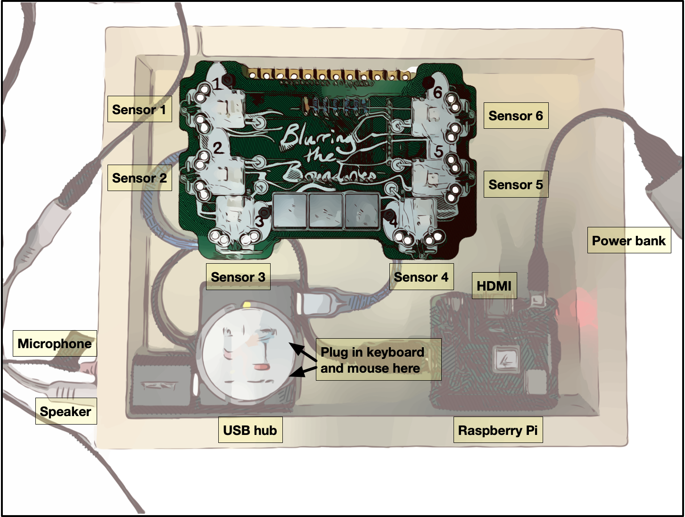
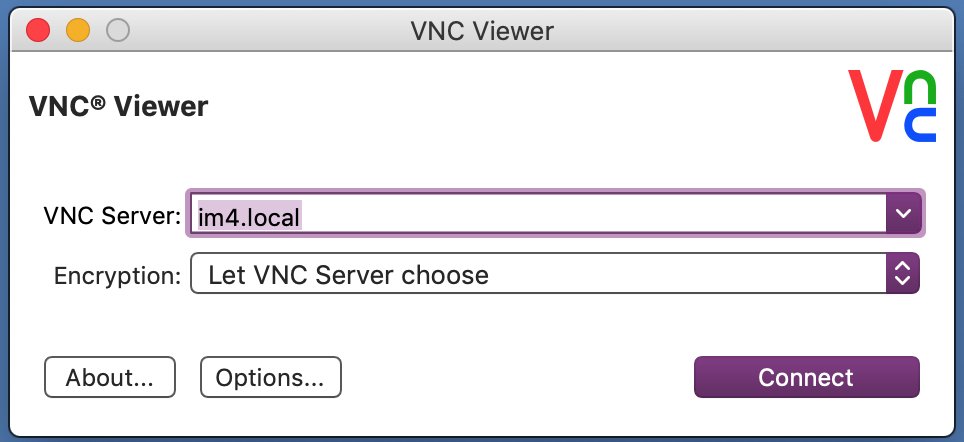

# IM Kits: basics

## Kit layout

## Initial setup

Load Balena Etcher to flash an SD card.  The SD card must be 32GB or larger.

Once the prepared SD card is inserted, plug the Raspberry Pi into a keyboard, mouse, and monitor to set it up.

Go to `Preferences -> Raspberry Pi Configuration` from the Raspberry Pi menu

Change the hostname to something unique (I have used im1, im2 etc. so far to distinguish between the different kits).  Write this down!

## Connecting

If at all possible, these kits should be used wirelessly by setting up a personal hotspot on your mobile phone, or an Ad Hoc network on your desktop/laptop computer.  Set this up initially with a keyboard, screen, and mouse connected: change the wireless network by clicking on the WiFi logo on the top-right corner of the screen.  

Once connected, your wireless hotspot password should be stored; you may now disconnect the keyboard and mouse to edit your patch.

Connect VNC Viewer to `im4.local` (replacing `im4` with the hostname you set in the initial setup) to access the desktop remotely.   

Press `connect`, and when prompted, input: **username**: `pi` **password**: `im.possibl3`

You should now see the Raspberry Pi's screen as a window on your computer, and be able to edit the code.

## Updating the Instrument Maker library

The Instrument Maker library is kept on GitHub, and should be pre-loaded on the Raspberry Pi.  To update the library to its latest version, load a terminal on the Raspberry Pi, and type the following:

`$ cd instrument-maker`

`$ git pull`

The library should now be updated to the most recent version. 

*Please note that this might fail if using one of the earlier versions of the kits — if so, go back to initial setup.*

## Files for autoload on boot

Pure Data will load automatically upon booting the Raspberry Pi, regardless of whether or not a screen is plugged in.  This allows the Raspberry Pi to function as an embedded instrument.

Save your file as `test.pd` on the Desktop to make your patch load when the instrument boots up.

### Starting a fresh file

For the time being, it's best to keep working on `test.pd` — to start from scratch:

- press `ctrl` - `a` to select everything, and press `delete`.
- create a new object by pressing `ctrl` - `1`
  - type `im.pi` and click outside the box

Now create the rest of your patch according to the tutorials.  The `im.pi` object tells Pure Data to look for the Arduino board and use it as a MIDI controller.

# Troubleshooting

# FAQ

**Will the SD card work on other types of Raspberry Pi, e.g. the 3B+ with more USB ports?**

Yes! But we still need to use the same USB audio device, as it's written into the startup script.  This is a problem with running the devices headless, but it's worth it..

**Why not use the built-in audio output on the Raspberry Pi?**

This was unexpectedly difficult to configure on the latest version of Raspbian.  Also, by using the USB sound devices, we automatically have a microphone input — even though it means we need to use a USB hub on the Raspberry Pi 3 A+!

**Why does the SD card need to be 32GB — isn't that a little big?**

That's the size I used at first, as I had planned to add some sample libraries, and the price was the same as a 16GB card..of course, I'm regretting this now as it takes quite a while to back up and flash a new card.  I will be working on something a lot smaller in the near future.

**Is it possible to connect to the Raspberry Pi with its own Ad Hoc WiFi?**

Working on it..but not yet.