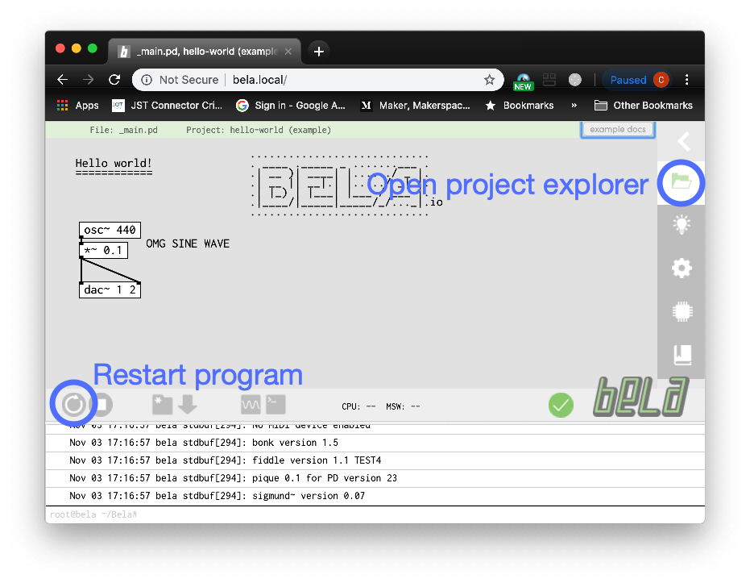
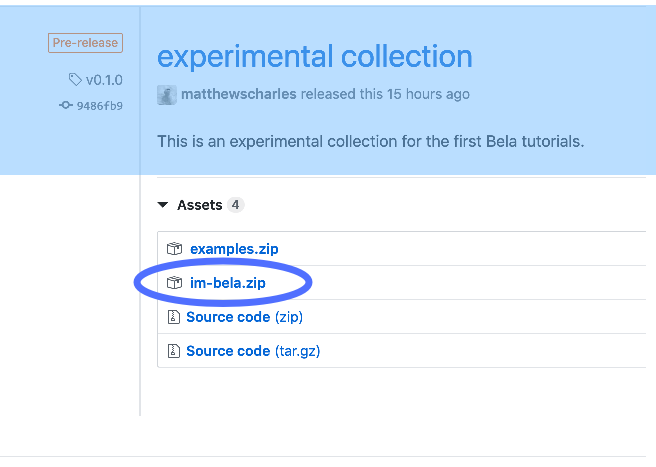
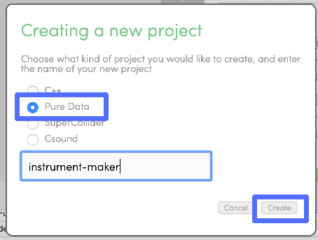
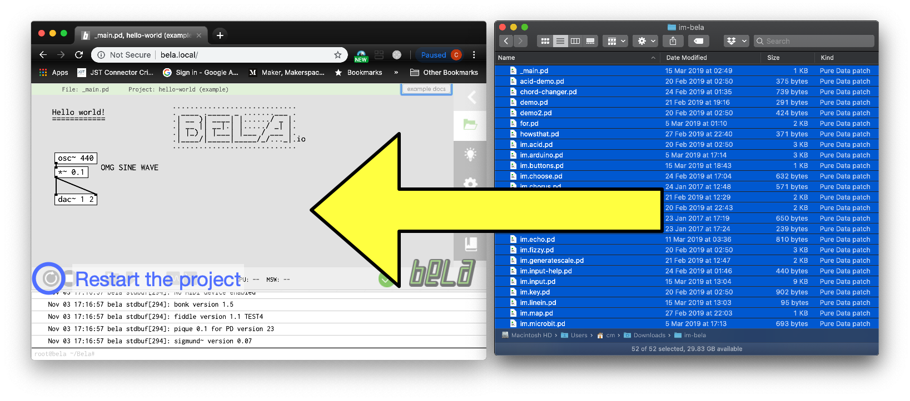
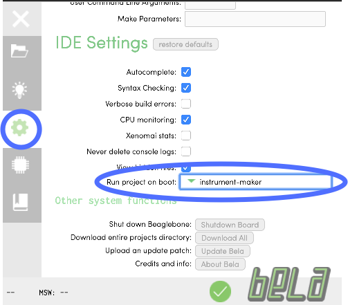
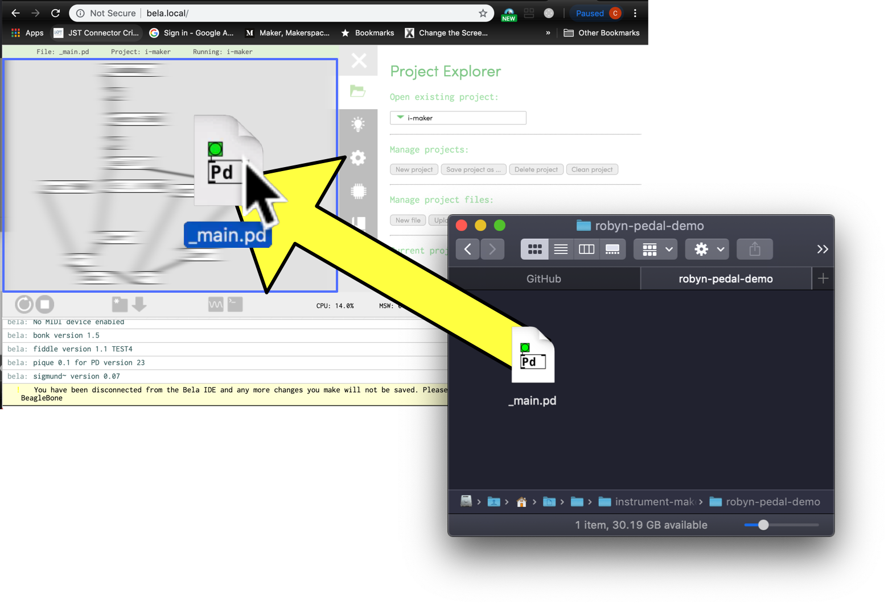

# Set up with Bela

For now, these instructions require transferring all the Instrument Maker files to each new project on the Bela board; there are better ways of doing this, but for now, this is the most reliable method to put into some short bullet points!

## Test the connection

- First, plug your Bela board into your computer. Wait one minute for the Bela to start, then open a web browser, and go to [http://bela.local/](http://bela.local/). You should see the following screen:

  

  - Macintosh users: if this does not work, you may need to install The HoRNDIS driver: [http://joshuawise.com/downloads/HoRNDIS-rel7.pkg](http://joshuawise.com/downloads/HoRNDIS-rel7.pkg)
  - If you see a mostly blank screen, and the menu on the right-hand-side only gives an option "Choose a project from your board" repeat the process by unplugging the USB cable, plugging it back in, and refreshing the browser.

## Download and create an instrument maker project

This stage involves dragging files from finder into the web browser; you might like to read through all the steps to get a sense of what needs to happen.

- Open a new browser window or tab, and go to the releases section of the GitHub repository: [https://github.com/matthewscharles/instrument-maker/releases](https://github.com/matthewscharles/instrument-maker/releases)

  - Download the **latest** version of `im-bela.zip` from this page.

    

- Open `Finder`. Look for the .zip file, and extract the contents (usually double-click).

  - Navigate to the folder created by this process. Press `CMD-A` on your keyboard to 'select all'. We will return to this window in a couple of steps.

- Go back to [http://bela.local](http://bela.local) in the web browser.

  - Click the folder on the right-hand side to open the project explorer, and click the `New project` button to create a new project.

  - Set the new project to `Pure Data`, and give it a name (e.g. Instrument Maker).

    

  - Return to the Finder window, and drag the contents of the folder into the IDE window (making sure that all the files are selected). You should receive a message asking if you would like to overwrite `_main.pd` — click `Overwrite`. 

  - You should see a lot of activity in the main window; once this has finished, restart the project using the circle icon toward the bottom-left of the screen. You should now hear the demo patch.

  ### Set the startup project

  - Go to the settings page by clicking on the cog-style icon, and set `Run project on boot` to the name of your file.

  

  ## Upload a different example

  - Create a project as above, making sure all the files from the `im-bela` folder have been transferred to the folder.  Download the example folders — these generally consist of one file named `_main.pd` — and drag the file(s)` into your project. When prompted, select Overwrite.

    