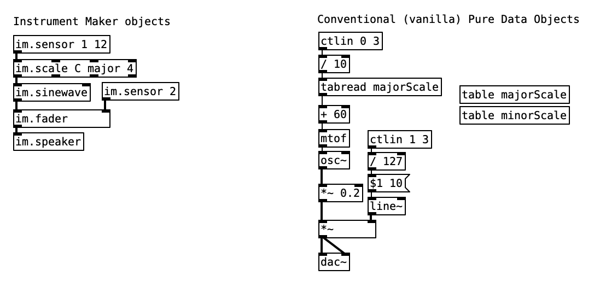
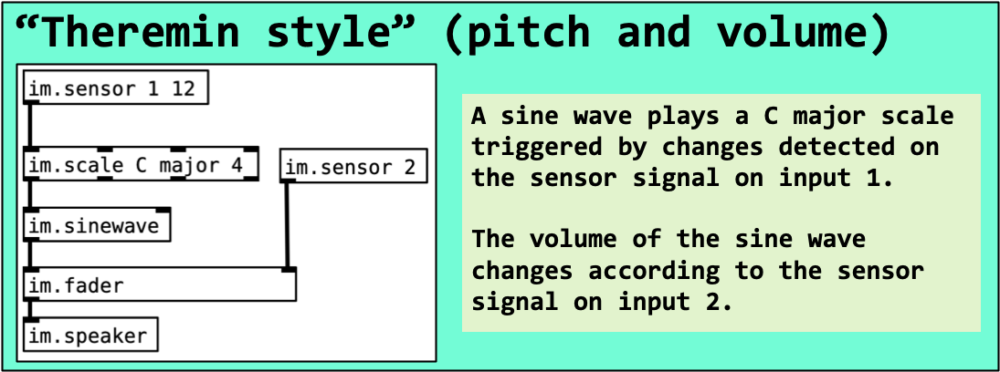
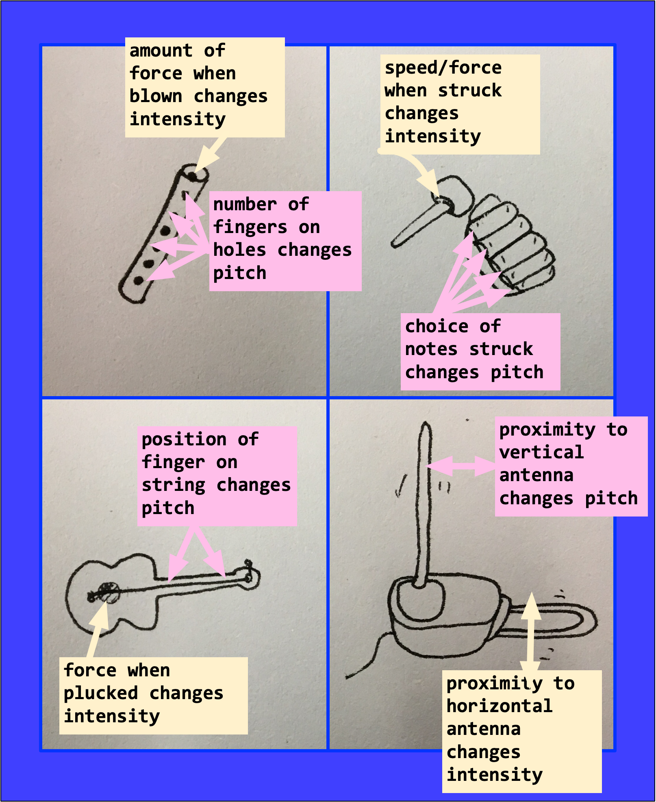

**Draft manual: Learning PD with Instrument Maker** 

Charles Matthews 2020

Incorporating contributions from [Robyn Steward](https://www.robynsteward.com/music), Houda Jawhar, Ann-Louise Davidson ([Education Makers](http://www.educationmakers.ca/)/[#MilieuxMake](http://www.educationmakers.ca/makerspace/)), [Dave Darch](https://alittlelearning.org/), Gift Tshuma ([Blurring the Boundaries](http://blurringtheboundaries.org/)), and with thanks to many others who have been involved in some way. 

# Disclaimer and development info

The Instrument Maker library is very much work in progress and a labour of love — so please don't be surprised if things change around! 

Make sure you have the most recent version of this document from [instrumentmaker.org](instrumentmaker.org), and update the software regularly by pulling from GitHub.  

Since you're reading this, chances are you have one the Instrument Maker kits — you might also find [this documentation](https://github.com/matthewscharles/instrument-maker/blob/master/documentation/manual/imkits.md) useful.

A glossary of terms used is available [here](glossary.md).

If you have any issues with the software, including requests for clarity or additions to this documentation, please use the [issues forum](https://github.com/matthewscharles/instrument-maker/issues).

This manual is currently presented a raw [MarkDown](https://www.markdownguide.org/) document.  As a result, the images vary in size and quality, as does the general layout. 

# Introduction

## What is PD (Pure Data)?

[Pure Data](http://puredata.info/) (PD for short) is a free, open source [dataflow](https://en.wikipedia.org/wiki/Dataflow_programming) programming language. 

- Create and connect graphic objects on-screen, rather than writing lines of text code.
- Pure Data is friendly to many musicians because it can feel similar to making physical connections between instruments and effect pedals.
  - By changing the order in which the pedals (or objects) are connected, we can change the sound produced.
  - Sometimes this way of organising information can lead to a more playful approach, and affords connections between objects that weren't intended by the creator - just like a lot of commercial music software.

### Why use Pure Data?

Pure Data is free and open source, meaning that members of the community can edit the code and create their own versions of the software.

Pure Data code can be applied in a variety of music making contexts, including [the web](https://github.com/sebpiq/WebPd), [audio apps for Android and iOS](http://danieliglesia.com/mobmuplat/), and running on embedded computers like the [Raspberry Pi](https://puredata.info/docs/raspberry-pi) and [Bela](http://bela.io/).

## What is Instrument Maker?

Instrument Maker is a toolkit designed for making music quickly with sensors.  This includes a library for Pure Data: a set of "objects" intended as an introduction to audio coding. 

The core aim is to enable beginners to make a wide range of sounds in a musical context, within a matter of minutes. The user should gain a basic idea of how dataflow programming works, while fulfilling the goal of making sound with some commonly accepted musical qualities (e.g fitting to the notes of a scale) as soon as possible.  It is then up to the individual to decide whether they wish to dig deeper into the programming itself.

<!--Here's an image comparing a patch made with the Instrument Maker library, with objects that come with Pure Data by default.  Both patches perform the same function:-->

<!---->

Instrument Maker objects can be used alongside regular Pure Data objects, so that the transition to usual Pure Data objects can take place gradually. In the future, there will be a section dedicated to this toward the end of this document.  

By itself, the Instrument Maker library is intended to be used in the "back end" of a program, separating the graphical interface from the code.  This idea might be counter intuitive to experienced PD users and teachers!

There are also Instrument Maker boards available to simplify the hardware construction process in a similar manner.  If you're reading this document, you probably have one of these boards. Alongside these resources, we hope to add other functionality to address the absence of screenreader support, switch access to to the software etc.

## Help files and object list

Each object has an associated "help file", which can be accessed by right-clicking and selecting `help`.  The help files contain functioning examples which can be modified, copied, and pasted into your own project.

To find a list of objets with their basic functions, look for `im-current-objects.pd` in the `learning-examples` folder.

# Hardware resources

At present, the Instrument Maker code functions best with the following items:

- [Bela](https://bela.io/) 
- [Raspberry Pi](https://www.raspberrypi.org/), connected to [Arduino](http://arduino.cc/) (best support with Leonardo, [Bare Conductive Touch Board](https://www.bareconductive.com/shop/touch-board/), or other 32U4-based boards that support [native USB MIDI](https://www.arduino.cc/en/Tutorial/MidiDevice)) or [Micro:Bit](https://microbit.org/) (resources currently in development)

Although these hardware resources can be used to control motors, lights, and other outputs, at present the Instrument Maker library is designed to work one way: to convert sensor information into audio signals (whether you prefer to think of this as vibration, sound, or music). 

Therefore, it's safe to assume that any external connections mentioned below (apart from microphones and speakers) are sensor inputs. 

## Operating without the Instrument Maker hardware

The easiest way to try some Instrument Maker code without any of the specially designed kit (but retaining the separation between hardware and software) is to use a MaKey MaKey, which sends keystrokes by default.

Try the help files for the `im.keypress` and `im.makeymakey` objects to see this in action.

We are working on support for quick access to Arduino through [Firmata](https://www.arduino.cc/en/reference/firmata) (something like [Pduino](https://puredata.info/downloads/pduino)) .

# Anatomy of a Pure Data object

Each object has a **name**, **arguments**, **inlets**, and **outlets**:

## Object name

The objects must have a name, which determine their function. Objects from the Instrument Maker library start with the letters **`im.`**

## Object arguments

Arguments are numbers (or occasionally words) that provide the object with more details on how to operate. 

For example, having named an `im.echo` object, we can also set its time (how short or long the echo is), and the amount of feedback (affecting how many times the echo repeats). 

Arguments in Pure Data are written after the name of the object, and separated with spaces.  Each argument affects a different parameter.  The arguments must be written in a specific order, as documented in the help files.

### Comparison with other languages

Unlike more contemporary languages such as Swift, the names of arguments are not included in the code or display, meaning that the user must remember what each argument does (and the order in which they need to be written), or consult a reference (once it has been written properly..I know..).  For people that have worked with other (text-based) programming languages, it might be useful to picture an object and its arguments like this: 

`name(argument, argument)`

Therefore, more concretely: `sensor 1 12` would be equivalent to `sensor(1, 12)` in a text based language — *read the sensor connected to pin 1, and multiply the output by 12*.

`scale C major 3` would be equivalent to `scale(C, major, 3)` — *process the incoming signal as a scale with root note C, using a major key, starting at octave number 3*.

## Inlets and outlets

Information flows one way in Pure Data: downwards. Inlets can only be connected to outlets -- an inlet can not be connected to another inlet. When clicking and dragging to create connections, the connection must always be started from the outlet.

<!--- parentheses example --->

Not all objects have the same numbers of inlets or outlets. Furthermore, some might only have an inlet or an outlet.  For example, the im.speaker object only has an inlet, because the output takes place in the physical world.

In general, the left-most inlet is the most important — this is where the primary signal to process should be sent through.  Other inlets 

Multiple objects can be connected to each other -- so, for example, a single sensor input can be used to control several sounds or parameters. 

*Note: since the Instrument Maker library is a work in progress, some of the inlets and outlets don't have an obvious function — they've been left in for testing purposes or for future features.  For example, the scale object only really handles information in its main inlet and outlet.*

A convention: the 

# First steps in Pure Data 

This tutorial assumes you are running Pd v0.49 upward on a Raspberry Pi.  

*Mac users should change references to `ctrl` to the `CMD` key.*

## Creating and connecting objects 

### Creating an object

Press **`ctrl`** and **`1`** on the computer keyboard, or go to the **`put`** menu at the top of the window and choose **`object`**.

Type the name of the object into the box.

Type any arguments required, making sure you include spaces.

Click on the background (anywhere outside the object) to finish the box. 

#### Troubleshooting

If there is a problem with the object, the box will appear with a dotted outline.  There are a few  possible reasons for this happening:

- there is no object with the name you used — make sure the Instrument Maker library is installed, and that you have spelled it the object name correctly
- there are capital letters somewhere in the object name — almost all object names are lower case
- there are spaces missing between the object name and arguments

### Editing an object

Click on the object to place the text cursor, and type your changes in.  Click outside the object to close the box.

Resize the object by moving the mouse pointer over the object's right-hand border, and dragging.

Move objects by dragging on them with the mouse (don't click on them first — the software will think that you are trying to edit the text!).  

### Connecting objects

Click and hold the mouse cursor over an outlet to start the connection. As you move the mouse over the outlet, the pointer should turn into a circle.

Keep holding the mouse button down while you drag onto the inlet of a second object.  You should see a black line extending, and the mouse pointer will turn into a finger.  When the pointer is over a compatible inlet, it will turn back into a circle, and you can let go.

### Shortcuts and tips

Instead of clicking on the background, press **`ctrl`** and **`1`** while the box is still highlighted to create another object — the next object will be connected automatically.

Instead of creating a new object, you might wish to select an object and press **`ctrl`** and **`d`** to duplicate it.  This can be useful if you are creating similar chains of objects.  

Move the objects around to make space for your objects on screen — try not to cram them in too tightly!

## Basics: connecting a microphone

Create a microphone object (`im.microphone`)

Create a speaker object (`im.speaker`)

Join the microphone and speaker with a cable: click and drag from the outlet on the bottom of the microphone object, and connect it to the inlet at the top of the microphone object.

### Adding an effect

Insert an effect into the signal path, like so:

Create an `im.echo` object, with delay time in milliseconds and feedback amount.

Connect the echo as a send effect:make a second cable from the im.microphone object, and connect it to the input of the echo (the left side).  Connect the output of the echo directly to the speaker.

# Examples

Depending on interest of the user, the following are recommended starting points for using Instrument Maker:

## **"Theremin style"**

## **Envelope follower**

## **Pitch tracker**

## **Loop pedal**

# <!--Key im objects-->

<!--Placeholder — work in progress!-->

## <!--im.sensor-->

<!--***No inlet***-->

<!--**Outlet:** sensor reading-->

<!--**Arguments:**-->

1. <!--the name or number of the input to read from-->
2. <!--multiplier-->

<!--The multiplier can be used to set how many notes are played (when combined with im.scale)-->

## <!--im.speaker-->

<!--**Inlet:** the signal to go to the speaker-->

<!--**Outlet:** no outlet-->

<!--***No arguments***-->

<!--No--> 

# Key concepts

## Signal flow

The order in which objects are connected affects their sound and/or behaviour. 

Unlike a physical circuit, the information flows in a linear fashion from the top to the bottom of the screen, and does not need to return to its start point.

### Effects: inserts and sends

Effects can be thought of as being inserted in series or parallel with their original sound.

An "insert" replaces a signal with its effected version ("in series"). 

A "send" (also known as an auxiliary or aux send) involves a signal being duplicated, with an effect applied ("in parallel"). 

## Instrument elements

Interactions with live instruments can often be divided up into controlling **pitch** and **intensity/loudness**.  These two parameters make a good starting point when designing an electronic instrument.  For example:

The main difference in these examples can be found in percussion instruments (like the gamelan example above, or playing a piano-style keyboard): in these cases, each note is a fixed in a specific place, and so the player changes the volume by striking it.

All of these interactions can be approximated through a combination of sensors; the controls can even be shared to create a collaborative instrument that must be played by two people (one person taking pitch, the other taking volume/intensity.  

Other examples along these lines include:

- "pitch and velocity pairs" in MIDI instruments
- bowing a string instrument while changing pitch on its neck
- scratching a record on a turntable while changing volume with the crossfader 

*<!--Placeholder: flute example-->*

# Making the transition from Instrument Maker

## Pure Data

So far, the objects we have been using from the Instrument Maker library have all worked with audio signals.  In more general practice, Pure Data makes distinctions between messages and signals — and the name of the objects using audio signals are marked with a tilde: `~`

<!--Examples to add:-->

- <!--Sequencer-->
- <!--Stereo with dac~-->
- <!--MIDI control-->

## Arduino and physical circuits

- Insert voltage divider circuit here

# References/learning resources

Please note that due to some specific features and workflows within IM, it may be confusing to jump back and forth between the documentation and these other resources. 

A transition document is currently under development.

- [Programming electronic music in Pd](http://www.pd-tutorial.com/) (Johannes Kreidler)
- [Designing Sound](https://mitpress.mit.edu/books/designing-sound) (Andy Farnell) — tutorial PDF [here](http://aspress.co.uk/ds/pdf/pd_intro.pdf)
- [Pure Data and Bela](https://blog.bela.io/2019/03/06/pure-data-and-bela/) (Robert Jack)

# Notes for experienced PD users

Instrument Maker objects are created in Pd Vanilla for maximum compatibility — they are all abstractions, and free to open and explore!  Hopefully there will be better documentation within the patches soon.

Objects in the Instrument Maker library all use audio connections — at present, there aren't really any traditional "control" messages in use.

There are only two elements available: objects and cables.  This reinforces a deliberate separation of interface and code. Users are not encouraged to use GUI objects (including messages) in the initial stages, which might feel counter-intuitive to some people!

This also means that we can stay in edit mode 100% of the time..avoiding opening the abstractions by accident.

The inputs described here are roughly equivalent to "pins" on an Arduino or Bela board.

The im.sensor objects are actually MIDI CC inputs converted to audio with a range 0-1!  This is intended to create continuity between working with Bela (which presents sensor inputs as audio) and platforms like the Raspberry Pi.

